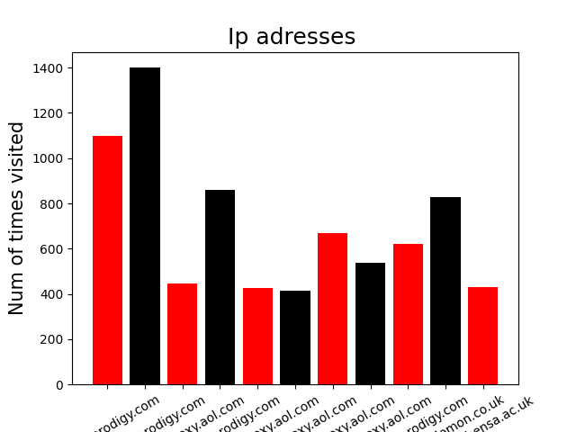
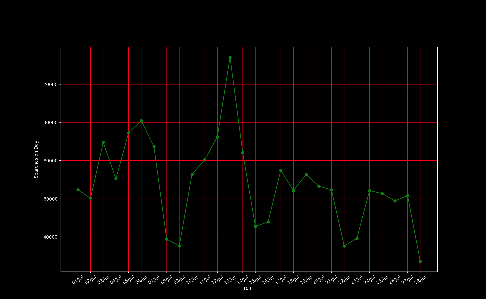

# Introduction
I gathered information from a nasa file which contained dates and time when specific DNS servers were on the web server. This information expanded
from the 5th of July 1995 to July 28th 1995

## Graph 1 data

This first thing I gathered were which DNS servers were making the most visits. 
I found out the greatest Domain name had roughly 1400 visits. 
The least amount of visits on the graph was around 400 visits 

## Graph 2 Data 

In the 2nd graph, I gathered information on the daily visits received. 
July 13th had the gratest visits which were around 135000.
July 28th had the least visits which were around 25000. 
After July 13th you can see a downward trend occuring. 

